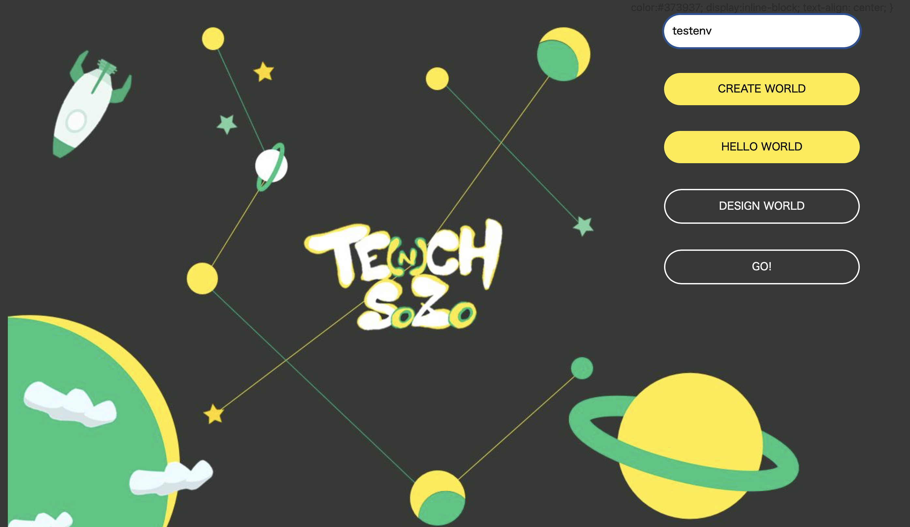

# Te(n)ch-SOZO

## 製品概要
### 天地創造 X Tech

### 背景（製品開発のきっかけ、課題等）
- 機械学習の環境構築は初学者にとって複雑
- 環境構築のハードルが高く学習をなかなか始められない

### 製品説明（具体的な製品の説明）
このソフトウェアを進めれば、機械学習に必要な環境を簡単にインストールできます。必要なライブラリは仮想環境を作ってから、インストールするので安心です。インストールが完了したら、jupyter notebookが起動するようになっていて、すぐに機械学習を開始できます。作った仮想環境やインストールしたライブラリもワンクリックで確認できます。

### 特長

#### 1. 仮想環境を新規作成

#### 2. 機械学習に必要なライブラリをインストール

#### 4. jupyter notebookの起動

#### 3. 自分がつくった仮想環境やインストールしたライブラリを一覧の形で取得できる

### 環境構築手順
#### 動作環境:macOS
#### 実行環境:python3, djangoを事前にインストールしている必要があります。
(pythonがダウンロードされていれば、pip djangoを実行してインストールができます)

本ソフトウェアをダウンロードした後、ダウンロードしたディレクトリにて以下のコマンドを実行してください

cd JPHacks2019-final/JPHacks2019-demofinal/VMforBeginner
python manage.py runserver

自動的にローカルサーバーが立ち上がりますので、http://127.0.0.1:8000 にアクセスしてください

#### 1.トップページ

##### create world
環境構築を始めましょう!
##### open world
これまでに自分がつくった仮想環境やインストールしたライブラリが確認できます(手順7へ)

#### 2.作りたい仮想環境名を入力してCreate World

JPHacks2019-final/JPHacks2019-demofinal/VMforBeginnerに自分の入力した名前で環境が構築され、その仮想環境が自動的に起動します。

#### 3.Hello world

真ん中に惑星が誕生しました。まだ必要なライブラリは揃っていないので、不毛な星のようですね。

#### 4.design world

環境を作っていきましょう。ライブラリのインストール画面に飛びます。
tensolflow、keras、chainerなどの機械学習ライブラリや、データの可視化のためのライブラリを選択しよう。SAVEを押すと、一発でインストールが開始するので、しばらく待ちましょう。
インストールが終わったら、nextボタンで次へ。(ここで空白のページに飛ぶ場合がありますが、その際は戻るボタンを押してください)

#### 5.できた!

早速GOを押しましょう。jupyter notebookという、機械学習をコードできるツールが起動します。

#### 6.jupyter notebook

必要なことはこれだけ! jupyter notebookは、とっても便利な機械学習のエディタです! 機械学習ライフを楽しんでください。

#### 7.open world

これまでに作った環境をこちらで確認できます。確認したい環境名を押してみてください。

#### 8.

インストールしたライブラリを確認できます。

### 解決出来ること
機械学習を敬遠していた人が、気軽に学習を開始できる。

### 今後の展望
・仮想環境の設定やインストールするライブラリを共有できるようにする機能まで実装することで、経験者の構築した画像解析や自然言語処理などに適切な環境をできるようにする
・ブラウザを利用してローカルフォルダを操作するため、適切なエラー処理などを実装して脆弱性を回避したい

## 開発内容・開発技術
### 活用した技術
#### API・データ
今回スポンサーから提供されたAPI、製品などの外部技術があれば記述をして下さい。

* なし
*
*

#### フレームワーク・ライブラリ・モジュール
* pythonベースのwebアプリケーションフレームワークdjangoを使用してローカルファイルをゴリゴリいじれるような仕様にした
*

#### デバイス
* PC(macで動作確認ずみ)
*

### 研究内容・事前開発プロダクト（任意）
ご自身やチームの研究内容や、事前に持ち込みをしたプロダクトがある場合は、こちらに実績なども含め記載をして下さい。
*仮想環境作成のコマンドやディレクトリ一覧を取得するための関数などがdjangoで実行できるかのテストまで行なっていた。当日は、画面遷移やUIやUX、仮想環境実行、インストールに必要な関数、インストール済みのライブラリを表示する関数、jupyter notebookの起動を具体的に記述して完成させた。

### 独自開発技術（Hack Dayで開発したもの）
#### 2日間に開発した独自の機能・技術
* UIUX
* 各コマンドの実行
 - 仮想環境構築
 - 作った仮想環境一覧の取得
